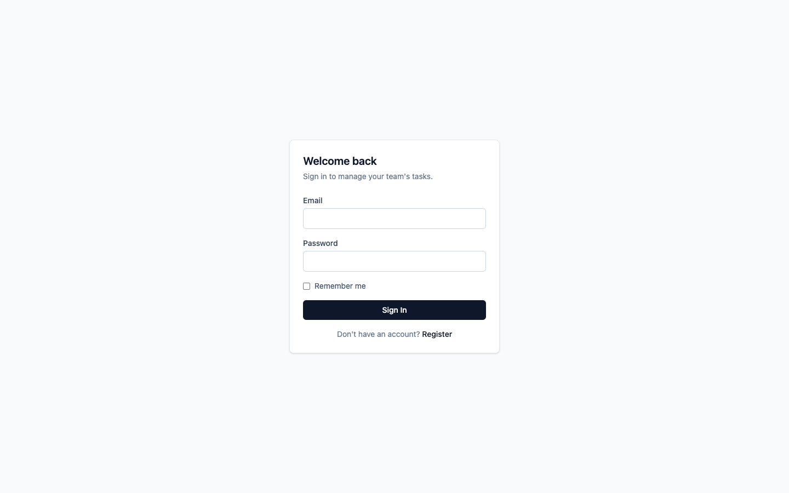
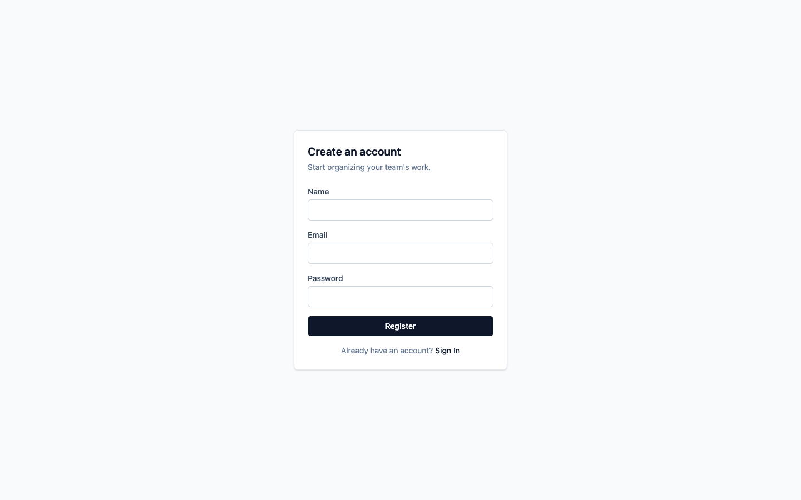
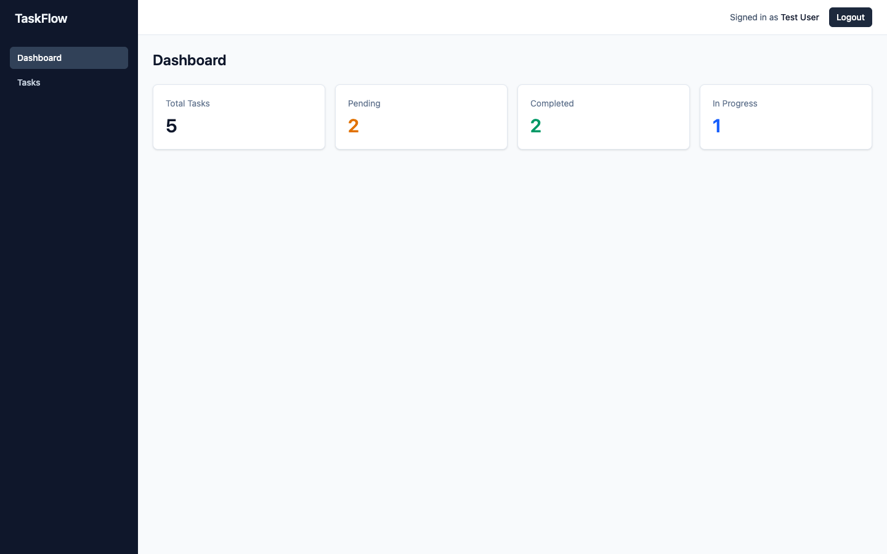
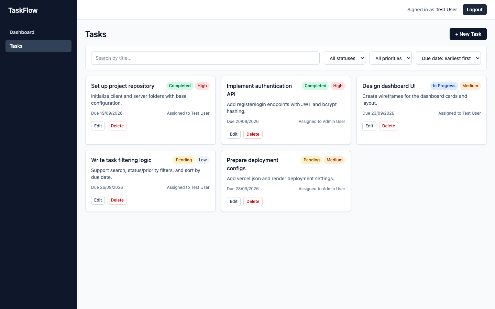
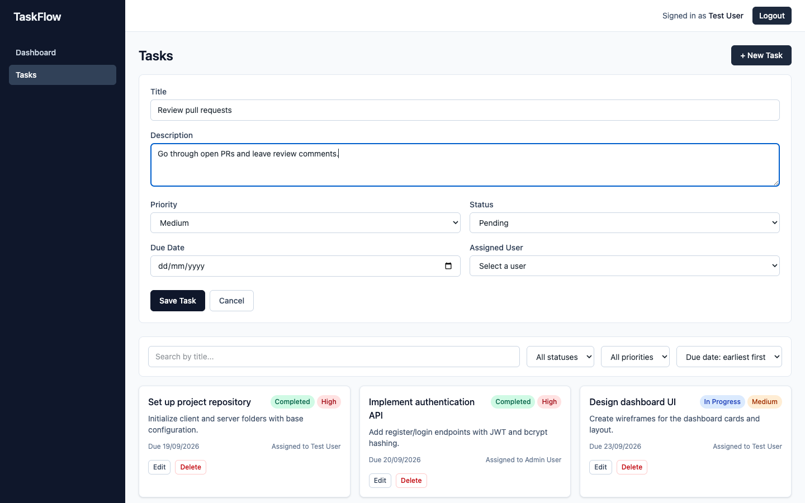
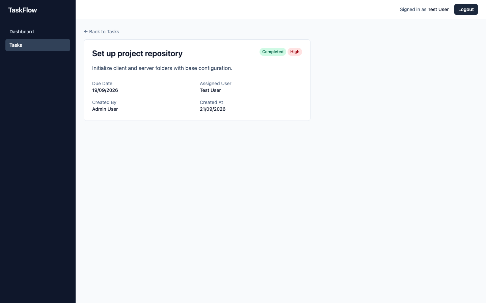

# Task & Team Management Platform

A full-stack task management app: JWT authentication, a dashboard with live task metrics, and full CRUD task management with search, filtering, and sorting.

## Live Demo

> Deployment (Vercel/Render/MongoDB Atlas) is pending — the app currently runs locally end-to-end. This section will be updated with live URLs once deployed.

- Frontend: _pending_
- Backend: _pending_

## Test Credentials

Both accounts are seeded via `npm run seed` in the `server/` folder (see [Setup](#setup)).

| Role (label only, no permission difference) | Email | Password |
|---|---|---|
| Standard User | `testuser@example.com` | `Test@1234` |
| Admin User | `admin@example.com` | `Admin@1234` |

## Tech Stack

- **Frontend**: React, Vite, React Router, Axios, Redux Toolkit, Tailwind CSS
- **Backend**: Node.js, Express, JWT, bcryptjs
- **Database**: MongoDB with Mongoose

## Folder Structure

```
Task-Manangement-System/
├── client/                # React + Vite frontend
│   └── src/
│       ├── components/    # Sidebar, Navbar, DashboardCard, TaskForm, TaskCard, ProtectedRoute, ...
│       ├── pages/         # Login, Register, Dashboard, Tasks, TaskDetails
│       ├── hooks/         # useAuth, useDebounce, useTasks, useUsers
│       ├── services/      # axios instance + API wrapper functions
│       ├── utils/         # validators, badge/label helpers, token storage
│       └── store/         # Redux Toolkit slices (authSlice, taskSlice) + store.js
├── server/                # Node.js + Express backend
│   ├── controllers/       # authController, taskController, userController
│   ├── models/            # User.js, Task.js
│   ├── routes/            # authRoutes.js, taskRoutes.js, userRoutes.js
│   ├── middleware/        # auth.js (JWT verify), errorHandler.js
│   └── config/            # db.js (mongoose connect), seed.js (seed test accounts)
└── docs/
    ├── screenshots/       # App screenshots
    └── postman_collection.json
```

## Setup (Local Development)

### Prerequisites

- Node.js 18+
- A running MongoDB instance — either local (`brew install mongodb-community` on macOS) or a [MongoDB Atlas](https://www.mongodb.com/atlas) connection string

### 1. Backend

```bash
cd server
npm install
cp .env.example .env   # edit MONGODB_URI / JWT_SECRET as needed
npm run seed            # creates the two test accounts + sample tasks
npm run dev              # starts the API on http://localhost:5001
```

`server/.env` variables:

| Variable | Description |
|---|---|
| `PORT` | API port (default `5001`) |
| `MONGODB_URI` | MongoDB connection string |
| `JWT_SECRET` | Secret used to sign JWTs |
| `JWT_EXPIRES_IN` | Token lifetime for normal login (e.g. `1d`) |
| `JWT_REMEMBER_EXPIRES_IN` | Token lifetime when "Remember Me" is checked (e.g. `30d`) |
| `CLIENT_ORIGIN` | Allowed CORS origin for the frontend |

### 2. Frontend

```bash
cd client
npm install
cp .env.example .env   # points VITE_API_BASE_URL at the backend
npm run dev              # starts the app on http://localhost:5173
```

Visit `http://localhost:5173`, and log in with one of the seeded test accounts above.

## API Documentation

All requests/responses are JSON. Endpoints under `/api/tasks` and `/api/users` require `Authorization: Bearer <token>`.

Base URL (local): `http://localhost:5001/api`

### Auth

| Method | Endpoint | Body | Description |
|---|---|---|---|
| POST | `/register` | `{ name, email, password }` | Create a new user account (password hashed with bcrypt) |
| POST | `/login` | `{ email, password, rememberMe }` | Authenticate and return a JWT |
| GET | `/me` | — | Return the authenticated user's profile |

**Register — success (201)**
```json
{ "token": "...", "user": { "id": "...", "name": "...", "email": "..." } }
```

**Register — duplicate email (400)**
```json
{ "message": "An account with this email already exists" }
```

**Login — invalid credentials (401)**
```json
{ "message": "Invalid email or password" }
```

### Tasks (protected)

| Method | Endpoint | Query / Body | Description |
|---|---|---|---|
| GET | `/tasks` | `?search=&status=&priority=&sortBy=dueDate_asc\|dueDate_desc` | List tasks, with optional search/filter/sort |
| GET | `/tasks/:id` | — | Get a single task (404 if not found) |
| POST | `/tasks` | `{ title, description, priority, dueDate, status, assignedUser }` | Create a task |
| PUT | `/tasks/:id` | any subset of the above fields | Update a task (404 if not found) |
| DELETE | `/tasks/:id` | — | Delete a task (404 if not found) |

### Users (protected)

| Method | Endpoint | Description |
|---|---|---|
| GET | `/users` | List `{ _id, name, email }` for all users — used to populate the "Assigned User" dropdown |

> `GET /users` is an addition beyond the assessment's documented table, needed to support the "Assigned User" field on tasks with real user references instead of free text.

### Error Responses

| Code | Scenario |
|---|---|
| 400 | Invalid request body (missing/invalid fields, duplicate email) |
| 401 | Missing, invalid, or expired JWT; bad login credentials |
| 404 | Resource (task/route) not found |
| 500 | Unexpected server error |

Every error response has the shape `{ "message": "..." }`.

An importable API collection is available at [`docs/postman_collection.json`](docs/postman_collection.json).

## React Concepts Used

- **Hooks & performance**: `useState`, `useEffect`, `useMemo` (task filtering/sorting and dashboard stats in `useTasks`), `useCallback` (stable handlers), `React.memo` (`DashboardCard`, `TaskCard`, `SearchFilterBar`), and custom hooks (`useAuth`, `useDebounce`, `useTasks`, `useUsers`)
- **State & loading**: Redux Toolkit for global auth/task state, `React.lazy` + `Suspense` for route-level code splitting (Dashboard/Tasks/TaskDetails)
- **Validation**: required-field checks, email format, password strength, duplicate-user handling, and invalid/expired JWT handling (auto-logout on 401)

## Screenshots

| Login | Register |
|---|---|
|  |  |

| Dashboard | Tasks |
|---|---|
|  |  |

| Task Form | Task Details |
|---|---|
|  |  |

## Notes

- No role-based access control is implemented — both seeded test accounts are plain users with identical permissions.
- No bonus features from the assessment's bonus list were implemented in this pass; the focus was the core functional requirements.
